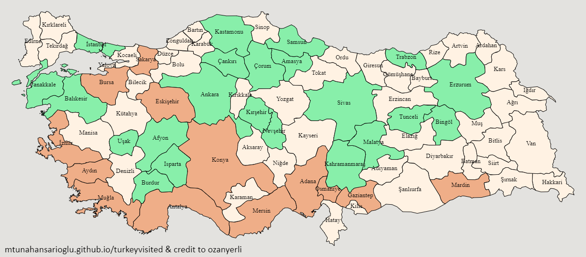

# I-SAW Game

This mini-game is built for 2 players. Rules and flow are extremely simple.
* Each player takes turns choosing the city they want to choose. 
* If the player does not have a city to choose from, then presses the "Resign" button. 
* After resign button is pressed, the other player can choose as many cities as they want. 
* The map is downloaded by pressing the "Download Map" button.

https://mtunahansarioglu.github.io/turkeyvisited/

# TurkeyVisited

Mark the cities you have visited in Turkey and share the map!

https://ozanyerli.github.io/turkeyvisited/

